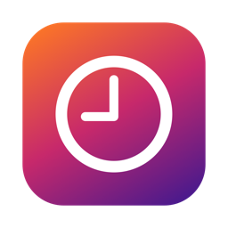

<p align="center">
  
</p>

<h1 align="center">Outatime</h1>

<p align="center">
  A tiny menu bar time tracker for macOS.<br>
  One click to start, one click to stop, a calendar-style logbook to fix what you forgot.
</p>

<p align="center">
  <a href="https://github.com/mrbarkan/Outatime/releases/latest"></a>
  
  
  <a href="LICENSE"></a>
</p>

---

## Why

Most time trackers want a project, a client, a billing rate and an account. Outatime wants to know one thing: are you working, on a break, at lunch, or doing extra hours? It lives in the menu bar, keeps its data in a single JSON file on your Mac, and never phones home (except to ask GitHub if there's a newer version).

## Features

- **Menu bar tracking** — four tiles: Work, Break, Lunch, Extra. Press one to start, press it again to stop. The menu bar shows the icon and elapsed time.
- **Optional tag** — type a project or ticket while tracking; it's saved with the entry.
- **Logbook** — a calendar-style day view. Drag an entry to move it, drag its edge to resize, click to edit, double-click empty space to add one. Jump between days and months.
- **Daily balance** — worked time (work + break + extra; lunch is unpaid) against a target you set, shown in the menu and the logbook.
- **Day templates** — save a typical day and apply it to any date in one click.
- **CSV export** — a daily summary and a full entry list per month. Drops straight into Notion, Numbers or a spreadsheet.
- **Settings** — light/dark, language (English, Español, Português BR), what the menu bar shows, open at login.
- **Updates** — the app tells you when a newer release is on GitHub.
- **Native** — SwiftUI, Liquid Glass, sandboxed, notarized. No Electron, no accounts, no telemetry.

## Install

Download `Outatime.dmg` from the [latest release](https://github.com/mrbarkan/Outatime/releases/latest), drag it to Applications, launch it. It appears in the menu bar as a clock.

Requires macOS 26 (Tahoe) or later.

## Data

Everything lives in one file you own:

```
~/Library/Containers/com.dbarkan.Outatime/Data/Library/Application Support/Outatime/data.json
```

Back it up, sync it, `jq` it — it's just entries and templates.

## Export

Menu bar → **Export**, or the Logbook toolbar. Two CSVs per month:

| File | Columns |
|------|---------|
| Daily summary | Date, Work, Break, Lunch, Extra, Balance, Tags |
| Entries | Date, Activity, Tag, Start, End, Hours |

Balance = work + break + extra − daily target. The target is a stepper at the bottom of the Logbook (default 8 h).

## Build from source

```sh
brew install xcodegen
xcodegen generate          # project.yml → Outatime.xcodeproj
open Outatime.xcodeproj    # ⌘R
```

Or headless:

```sh
xcodebuild -project Outatime.xcodeproj -scheme Outatime -configuration Debug -derivedDataPath build/dd build
open build/dd/Build/Products/Debug/Outatime.app
```

Tests: `xcodebuild -project Outatime.xcodeproj -scheme Outatime test` (Swift Testing; includes a check that every UI string has `es` and `pt-BR` translations in `Outatime/Localizable.xcstrings`).

### Layout

```
Outatime/
  OutatimeApp.swift   scenes: menu bar extra, Logbook window, Settings
  MenuPanel.swift     the menu bar popover
  EditorView.swift    Logbook: month sidebar + draggable day timeline
  Store.swift         entries, templates, JSON persistence
  Models.swift        Activity, Entry, DayTemplate
  Export.swift        CSV
  Updater.swift       GitHub Releases check
  Settings.swift      Settings window, appearance/language/login item
scripts/
  release.sh          archive → Developer ID export → DMG → notarize → GitHub release
  make-icon.swift     regenerates the app icon from AppKit drawing code
```

## Release

One-time: store notarization credentials (app-specific password from appleid.apple.com):

```sh
xcrun notarytool store-credentials outatime-notary --apple-id <apple-id> --team-id L26TPPMPF3
```

Then bump `MARKETING_VERSION` in `project.yml` and run `scripts/release.sh`. It builds, signs, notarizes, staples, and publishes `build/Outatime.dmg` as GitHub release `v<version>` — which is what the in-app update check looks for.

## Contributing

Issues and pull requests welcome. Keep it small: this app is deliberately minimal, and the best PR is often the one that deletes something. New UI strings need `es` and `pt-BR` entries or the test suite fails.

## License

[MIT](LICENSE) © 2026 David Barkan
