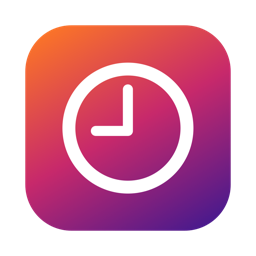

<p align="center">
  
</p>

<h1 align="center">Outatime</h1>

<p align="center">
  A tiny menu bar time tracker for macOS.<br>
  One click to start, one click to stop, a calendar-style logbook to fix what you forgot.
</p>

<p align="center">
  <a href="https://github.com/mrbarkan/Outatime/releases/latest"></a>
  
  
  <a href="LICENSE"></a>
</p>

<p align="center"><a href="https://mrbarkan.github.io/Outatime/manual/"><strong>Read the manual</strong></a></p>

---

## Why

Most time trackers want a project, a client, a billing rate and an account. Outatime wants to know one thing: are you working, on a break, at lunch, or doing extra hours? It lives in the menu bar, keeps its data in a single JSON file on your Mac, and never phones home (except to ask GitHub if there's a newer version).

## Features

- **Menu bar tracking** — six tiles: Work, Break, Lunch, Extra, Travel, Out of Office. Press one to start, press it again to stop. The menu bar shows the icon and elapsed time, or how far today is from your target.
- **Notes** — type what you're working on while tracking; it's saved with the block.
- **Clients** — pick a client from the grid in the menu and Work, Extra and Travel are tracked for them. Switching clients splits the running block right there.
- **Logbook** — a calendar-style day view. Drag a block to move it, drag an edge to resize it (hold ⌥ to move the border between two blocks), click to edit, double-click empty space to add one, double-click inside a block to cut in a break. ⌘- or ⇧-click several blocks and right-click to change their client or activity. The month sidebar draws every day on one scale, with a tick at the target.
- **Daily balance** — worked time against a target you set (by default everything but lunch counts), for today, the week, the month and an hours bank since a date you choose.
- **Stats** — what's left of this week's goal and how much more to bank for a day off, right in the menu. Averages per week, month and workday, your usual start and finish, and this month's figures in the Logbook.
- **Extra after the target** — once a day's worked time reaches the target, Work switches itself to Extra, cut at the exact minute. Weekends and days off are all Extra. Can be turned off.
- **Tomato timer** — turn it on from the menu for 25-minute focus rounds and 5-minute breaks (15 after every fourth). Each round ends with a notification whose button switches Work ↔ Break for you, and the menu bar counts down the round.
- **Stretch reminder** — a nudge to get up every 50 minutes of unbroken work (adjustable, or off).
- **Colored menu bar** — the icon takes the activity's color: blue for Work, green for Break, orange for Lunch…
- **Day templates** — save a typical day and apply it to any date in one click.
- **Excel reports** — a monthly report with hours per client, a month for one client to attach to an invoice, or a master workbook of everything with a dashboard up front. CSVs too, for Notion or Numbers.
- **Eight languages** — English, Español, Português (Brasil), Français, Deutsch, Italiano, 日本語 and 简体中文, in the app and in the [manual](https://mrbarkan.github.io/Outatime/manual/).
- **Settings** — five short tabs: General (appearance, language, menu bar, open at login, global shortcuts), Target, Focus (tomato timer and reminders), Clients and Updates.
- **Updates** — [Sparkle](https://sparkle-project.org): signed updates install themselves, no visit to the download page. Opt into beta builds in Settings → General.
- **Native** — SwiftUI, Liquid Glass, sandboxed, notarized. No Electron, no accounts, no telemetry.

## Install

Download `Outatime.dmg` from the [latest release](https://github.com/mrbarkan/Outatime/releases/latest), drag it to Applications, launch it. It appears in the menu bar as a clock.

Requires macOS 26 (Tahoe) or later.

## Data

Everything lives in one file you own:

```
~/Library/Containers/com.dbarkan.Outatime/Data/Library/Application Support/Outatime/data.json
```

Back it up, sync it, `jq` it — it's just entries, templates, clients and days off.

## Export

Menu bar → **Export**, or the Logbook toolbar.

- **Monthly Report (Excel)** — `Outatime 2026-09.xlsx`. *Summary*: one row per day (Date, Work, Break, Lunch, Extra, Travel, Out of Office, Worked, Target, Balance, Notes) with a totals row. *Clients*: hours per client, when you use them. *Entries*: every block (Date, Activity, Start, End, Hours, Notes, Client).
- **Client report (Excel)** — one client's month for invoicing: hours per day and the blocks behind them, no target or balance.
- **Master Workbook (Excel)** — `Outatime Master.xlsx`, everything since you started tracking: a *Dashboard* (hours worked, hours bank, days worked, average day, a worked-vs-target chart, breakdowns by activity and by month), then the same *Summary* and *Entries* sheets. Both are Excel tables, so pasting a month report's day rows right under them grows the tables and the dashboard follows. Re-exporting the master does the same in one step.
- **CSV** — the daily summary and the entry list per month, for tools that want plain text.

Worked = everything but lunch (Settings decides what counts); Balance = worked − daily target. The target is a stepper at the bottom of the Logbook (default 8 h).

## Build from source

```sh
brew install xcodegen
xcodegen generate          # project.yml → Outatime.xcodeproj
open Outatime.xcodeproj    # ⌘R
```

Or headless:

```sh
xcodebuild -project Outatime.xcodeproj -scheme Outatime -configuration Debug -derivedDataPath build/dd build
open build/dd/Build/Products/Debug/Outatime.app
```

Tests: `xcodebuild -project Outatime.xcodeproj -scheme Outatime test` (Swift Testing; includes a check that every UI string in `Outatime/Localizable.xcstrings` is translated into every language the Settings picker offers).

### Layout

```
Outatime/
  OutatimeApp.swift   scenes: menu bar extra, Logbook window, Settings
  MenuPanel.swift     the menu bar popover
  EditorView.swift    Logbook: month sidebar + draggable day timeline
  StatsView.swift     the Logbook's Stats popover
  WhatsNew.swift      release notes shown once after an update
  About.swift         the About window: version, support address, links
  Focus.swift         tomato timer, stretch reminder, notifications
  Store.swift         entries, templates, clients, JSON persistence
  Models.swift        Activity, Profile (client), Entry, DayTemplate, Target
  Stats.swift         week goal, day-off bank, averages
  Export.swift        CSV and the Excel reports' content
  Workbook.swift      minimal .xlsx writer: tables, styles, a chart, zip
  Updater.swift       Sparkle updater
  Settings.swift      Settings tabs, appearance/language/login item, the manual link
docs/manual/          the user manual (GitHub Pages), one folder per language
scripts/
  release.sh          archive → Developer ID export → DMG → notarize → appcast → GitHub release (--beta: pre-release)
  make-icon.swift     regenerates the app icon from AppKit drawing code
```

## Release

One-time: store notarization credentials (app-specific password from appleid.apple.com):

```sh
xcrun notarytool store-credentials outatime-notary --apple-id <apple-id> --team-id L26TPPMPF3
```

One-time: create the Sparkle signing key (kept in your login keychain) and paste the public half into `SUPublicEDKey` in `project.yml`:

```sh
.spm/artifacts/sparkle/Sparkle/bin/generate_keys
```

Then bump `MARKETING_VERSION` and `CURRENT_PROJECT_VERSION` in `project.yml` and run `scripts/release.sh`. It builds, signs, notarizes, staples, generates a signed `appcast.xml`, and publishes both as GitHub release `v<version>`. Sparkle reads the feed at `releases/latest/download/appcast.xml`, which always redirects to the newest release.

## Support

Questions, bugs or ideas: [opa@mrbarkan.com](mailto:opa@mrbarkan.com), or **About → Contact Support** in the app, which fills in your version and macOS.

## Contributing

Issues and pull requests welcome. Keep it small: this app is deliberately minimal, and the best PR is often the one that deletes something. New UI strings need entries for all seven translations (es, pt-BR, fr, de, it, ja, zh-Hans) or the test suite fails.

## License

[MIT](LICENSE) © 2026 David Barkan
